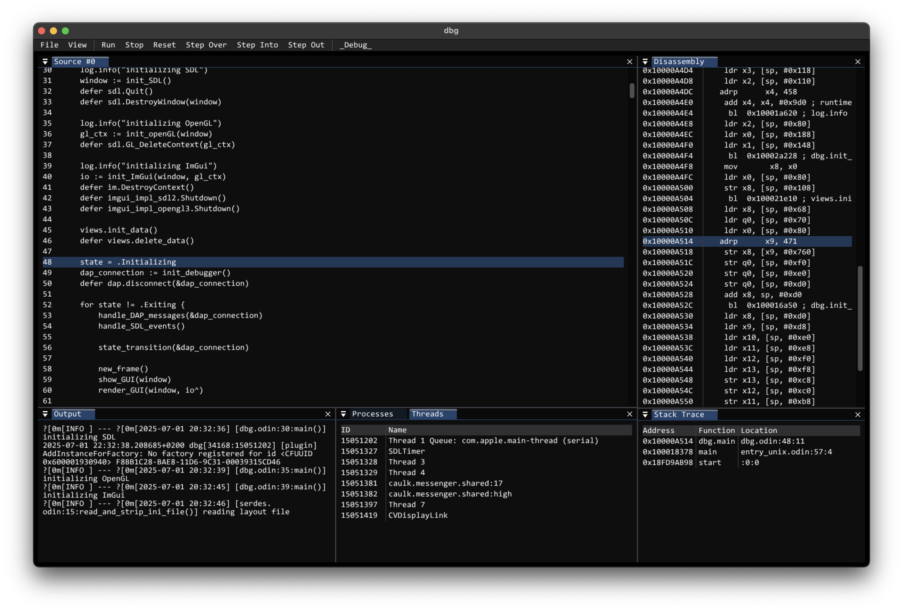

A frontend for any debugger that supports the Debug Adapter Protocol (eventually).
Currently hard-coded to use `lldb-dap` on MacOS and `gdb --interpreter=dap` everywhere else.

If it's not already clear, this software is in early development so expect things to not work as expected and crash fairly frequently.
